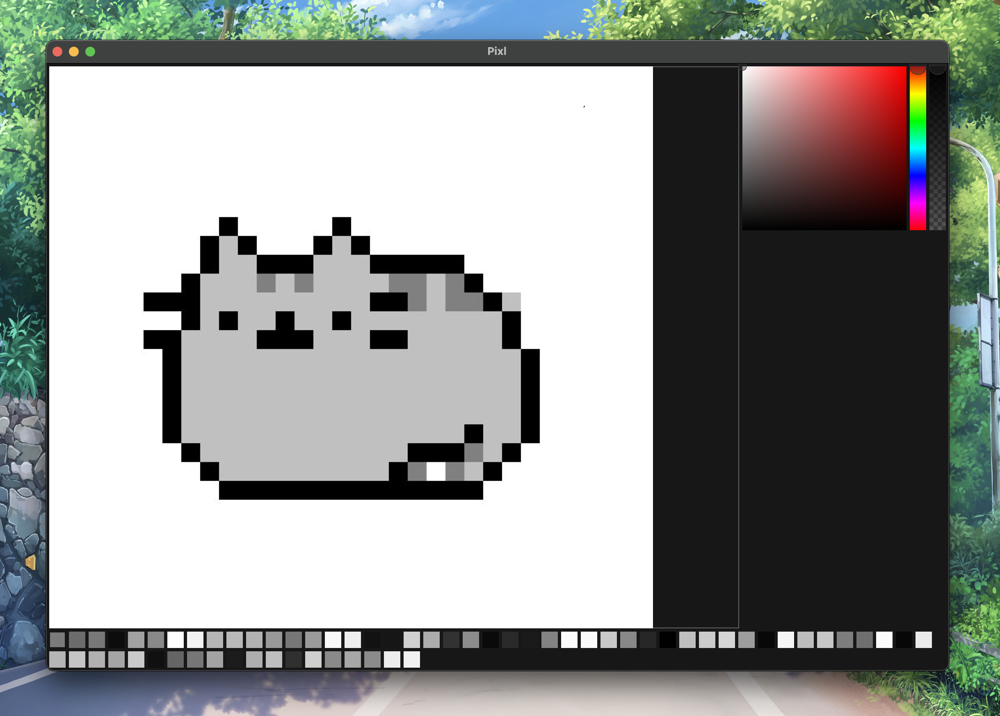

<h1 align="center">
  Pixl 
</h1>

  

 

 &nbsp;

## TL;DR

A clean pixel art drawing tool.

## Built With
This project was built using these technologies.

- Go with Fyne v2 library.

## Features

**Create:** starts a new drawing with the specified dimensions.

**Save as:** stores the drawing as a new file with the specified name.

**Save:** store the latest changes of the drawing in the previously declared file path.

**Drawing panel:** interactive interface with swatches for color storage.

## Getting Started

This software uses go 1.22.3 and it's required to use the tool.

## 🛠 Installation and Setup Instructions

1. Go to the project root folder.
2. Run go mod tidy.
3. Run `go run -v ./pixl`

## Usage Instructions

**Probably a pixel art drawing course is a good prerequisite.**
